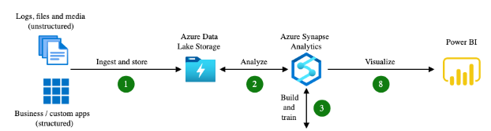

# cst8911-midterm-project

Group members:

+ Michael Balcerzak
+ Catherine Daigle
+ David
+ Rae Ehret
+ Van Anh Phan
+ Hanh Tran

## Topic: Scenario 2

> In azure, students must utilize a set of source data (e.g., customer data, transaction data) curated themselves or use data off websites like Github or Kaggle, and load it into Azure Blob Storage. Create a data warehouse in Azure Synapse Analytics and use PolyBase to load data from Azure Blob Storage. Utilize T-SQL scripts to transform the data in the data warehouse (e.g., aggregating, pivoting, and joining data). Finally create a Power BI report that queries the data warehouse and presents it in a meaningful way for stakeholders. The students will be evaluated on their ability to configure, secure, and optimize the Azure blob storage, Azure Synapse Analytics, and PolyBase. Following correct security protocols and best practices. 

We choose our dataset to be video-game related. Our sources will include Steam, and Kaggle.

## Required Documents

> Each group member will also complete a confidential Self and Peer Evaluation. The Peer Evaluation is submitted online see assignments section on the day the midterm is submitted.

## Final report

Include screenshots of every step and settings, please include the Microsoft Azure banner in the screenshots

Provide concise, short explanations on why certain settings were chosen, ie cost, compute power, etc

One individual must submit the final report for the group under the assignments section in Midterm Project category, please include group members full names

## Azure Scenario #2: End-to-End Workflow Tutorial

### Group of 6 Individuals

This tutorial outlines the workflow and services used to complete Scenario #2 using **Azure Blob Storage**, **Azure Synapse Analytics**, **PolyBase**, and **Power BI**. Each step is divided among six participants.

---

## Step 1: Setting Up Azure Blob Storage
*Assigned to Person 1*

1. **Log into Azure Portal**:
   - Go to [Azure Portal](https://portal.azure.com) and sign in.

2. **Create a Storage Account**:
   - In the search bar, type `Storage Accounts` and click `Create`.
   - Select your subscription and resource group.
   - Enter a unique **Storage Account Name**.
   - Set **Region** to `East US` and **Performance** to `Standard`.
   - Select `Locally Redundant Storage (LRS)` for replication.
   - Review and click `Create`.

3. **Create a Blob Container**:
   - Once the storage account is created, navigate to it.
   - Under **Data storage**, select `Containers`, and click `+ Container`.
   - Name the container (e.g., `customer-data`), set **Public access level** to `Private`, and click `Create`.

4. **Upload Data**:
   - Navigate to the container you created, click `Upload` and select the dataset (e.g., from GitHub, Kaggle, or a custom dataset).
   - Click `Upload` to store the data in Azure Blob Storage.

---

### Step 2: Creating a Data Warehouse in Azure Synapse Analytics
*Assigned to Person 2*

1. **Create an Azure Synapse Workspace**:
   - In Azure Portal, search for `Synapse Analytics` and click `Create`.
   - Enter the required details: Workspace Name, Region (East US), and Resource Group.
   - Select `Review + Create` and wait for the workspace to be deployed.

2. **Configure SQL Pool (Dedicated Pool)**:
   - Navigate to the newly created Synapse workspace.
   - Under `SQL Pools`, click `+ New` to create a SQL pool.
   - Provide a name, set **Performance Level** to `DW100c` (for the cheapest development option), and click `Create`.

---

### Step 3: Loading Data from Blob Storage into Azure Synapse Using PolyBase
*Assigned to Person 3*

1. **Configure Linked Service**:
   - In the Synapse workspace, go to `Manage` and select `Linked Services`.
   - Click `+ New` and choose `Azure Blob Storage` as the linked service.
   - Input the storage account name and key, then test the connection to ensure it works.

2. **Create External Table Using PolyBase**:
   - Go to the `Develop` tab and create a new SQL script.
   - Define external data sources, file formats, and tables using PolyBase, linking your Blob storage to the data warehouse.

3. **Load Data into the Data Warehouse**:
   - Use PolyBase to load the data from Blob Storage into your data warehouse, ensuring that the data structure matches the defined schema.

---

### Step 4: Data Transformation with T-SQL Scripts
*Assigned to Person 4*

1. **Write T-SQL Scripts**:
   - Perform data transformations such as aggregating, joining, or pivoting the data based on stakeholder requirements.

2. **Apply Advanced Queries**:
   - Use joins to combine datasets or pivot the data for better visualization.
   - Test queries in the Synapse workspace before running transformations on the data.

---

### Step 5: Creating a Power BI Report
*Assigned to Person 5*

1. **Connect Power BI to Azure Synapse Analytics**:
   - Open **Power BI Desktop** and click on `Get Data`.
   - Choose `Azure Synapse Analytics` as your data source and connect using your credentials.

2. **Query the Data**:
   - Select the necessary tables or views from your Synapse data warehouse.
   - Load the data into Power BI.

3. **Create Visualizations**:
   - Use bar charts, pie charts, and tables to visualize insights such as total sales, customer segmentation, or other relevant metrics.
   - Build a **Dashboard** for stakeholders to interact with.

---

### Step 6: Security and Optimization
*Assigned to Person 6*

1. **Secure Blob Storage**:
   - Navigate to the storage account and configure security settings such as role-based access control (RBAC), firewalls, and private endpoints.

2. **Optimize Synapse SQL Pool**:
   - Monitor performance metrics and adjust the performance level of the SQL pool based on the workload.
   - Implement partitioning, indexing, and caching to improve query efficiency.

3. **Implement Data Encryption**:
   - Ensure that all data stored in Blob Storage and Synapse Analytics is encrypted at rest.
   - Use Azure Key Vault to manage encryption keys securely.

---

### Final Deliverables

1. **GitHub Repository**:
   - All code, datasets, and configurations must be pushed to the team's GitHub repository.
   - Include documentation explaining the rationale behind the setup and configuration.

2. **Screenshots and Documentation**:
   - Capture screenshots of the process (storage setup, data loading, transformation, Power BI reports).
   - Upload the screenshots and explanations to **Brightspace** as per the course requirements.
   - Discussion Results: Microsoft Word or PDF

3. **Delete Resources**:
   - After the final demonstration, ensure all resources (Blob Storage, SQL Pools, Synapse workspace, etc.) are deleted to avoid unnecessary costs.

---

#### Evaluation Criteria:
- Configuration of Azure services (Blob Storage, Synapse, PolyBase): 20 marks
- Data transformation and optimization: 10 marks
- Power BI visualization and presentation: 10 marks
- Security and resource management: 10 marks

---

## Links

TODO

## References

## Dataset Were Working with for SQL
TODO

(from the cst8913 lecture week3)