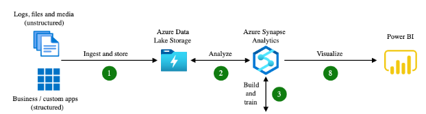

# cst8911-midterm-project

Group members:

+ Michael Balcerzak - 041169753
+ Catherine Daigle - 41175118
+ David - 041171487
+ Rae Ehret - 040907812
+ Van Anh Phan - 041006838
+ Hanh Tran - 041121693

## Topic: Scenario 2

> In this group we decided to do scenario 2 which we will describe below:

> First, we need to find and download a database which contains a set of data such as customer data or transaction data and load it to the Azure Blob Storage service. 
> Second, we need to create a data warehouse in Azure Synapse Analytics and use PolyBase to load the data from Azure Blob Storage. 
> Third, we need to create T-SQL scripts in order to transform the data in the data warehouse such as aggregating, pivoting, and joining.
> Last, we need to create a Power BI report to use the data from Synapse to presents it as different grapths such as line and pie graphs in order to analize and describe the data to stakeholders.

Therefore, we choose our dataset to be based on video-game. Our sources will be from Steam and Kaggle.

## Required Documents

> Each group member will also complete a confidential Self and Peer Evaluation. The Peer Evaluation is submitted online see assignments section on the day the midterm is submitted.

## Preparation Steps to do:

Step 3, Step 4 Step 5

- Prepare Steam API for Fetching - prepared.
- Research Polybase and warehouse - Rae & Catherine
- prepare T-SQL Scripts - Rae & Catherine
- Research PowerBI - Micheal & Van

## Azure Scenario #2: End-to-End Workflow Tutorial

### Group of 6 Individuals

The Azure applicaions we are using to complete this scenario are **Azure Blob Storage**, **Azure Synapse Analytics**, **PolyBase**, and **Power BI**. We divide this tutorial into 6 steps among the six participants in this group.

---

## Step 1: Setting Up Azure Blob Storage
*Assigned to Catherine and Rae*

1. **Log into Azure Portal**:
   - go to the Azure portal website and log in to your Azure account.

2. **Create a Storage Account**:
   - go to `All services` and look for `Storage account` and then select `Create` to start making the storage account.
   - fill in the details bellow
      - **Subscription**: your own subscription
      - **Resource group**: any resource group name
      - **Storage Account Name**: `cst8911midtermstorage`
      - **Region**: `Canada Central`
      - **Storage Account Name**: `cst8911midtermstorage`
      - **Region**: `Canada Central`
      - **Performance**: `Standard`.
      - **replication**: `Locally Redundant Storage (LRS)`
   - Leave the rest as default and click `Create`.

3. **Create a Blob Container**:
   - Ones it finishes creating, go access it.
   - Go to `Containers` in the **Data storage** section and make a new container by selecting `+ Container`.
   - Fill in the contents below:
      - **Name**: any desired name
      - **Public access level**: `Private`
   - select `Create`

4. **Upload Data**:
   - go to the container you made and select `Upload` and then pick the dataset you want to upload from such as GitHub, Kaggle, or custom.
   - Last select `Upload` to save the data in Azure Blob Storage.

---

### Step 2: Creating a Data Warehouse in Azure Synapse Analytics
*Assigned to Catherine and Rae*

1. **Create an Azure Synapse Workspace**:
   - Go to `All services` and look for `Synapse Analytics` and then select `Create` to start making the Synapse service.
   - Fill in the contents below:
      - **Subscription**: your own subscription
      - **Resource group**: the one you made in `Storage Account`
      - **Workspace name**: `cst8911synapse`
      - **Region**: `East US`
   - Fill in the other requried requirement on your own.
   - After finishing filling the details, go to `Review + create` and select `Create`

2. **Configure SQL Pool (Dedicated Pool)**:
   - After Synapes is created, go to its workspace.
   - Go to the `SQL Pools` selection and add a new SQL pool by selecting `+ New`.
   - Fill in the contents below:
      - **Name**: `cst8911pool`
      - **Performance Level**: `DW100c` (DW100c is the most cost effective option)
   - after done with the detail, select `Create`.

---

### Step 3: Loading Data from Blob Storage into Azure Synapse Using PolyBase
*Assigned to Catherine and Rae*

1. **Configure Linked Service**:
   - go to `Manage` and then select `Linked Services` in the External connections section.
   - to link the new Azure Blob Storage, select `+ New` and choose the `Azure Blob Storage`.
   - After that, input the storage account name you made and its key in the details.
   - Then test the connection to see if it works.

2. **Create External Table Using PolyBase**:
   - Go to the `Develop` s and create 4 new SQL scripts.
   - when making the SQL scripts, make the external data sources, file formats, and tables using PolyBase, then link the Blob storage aplication to the data warehouse.
   - Here is the name of the 4 sql files:
      - sql-1-master-key.sql
      - sql-2-external-data-source.sql
      - sql-3-external-file-format.sql
      - sql-4-create-tables.sql

3. **Load Data into the Data Warehouse**:
   - Finally, use PolyBase to load the data from the Blob Storage service to the data warehouse, showing that the data structure is the same as the schema defined.

---

### Step 4: Data Transformation with T-SQL Scripts
*Assigned to Tran*

1. **Write T-SQL Scripts**:
   - Write T-SQL Scripts in Synapse workspace in order to tranform, the data like aggregating, joining, or pivoting to complete the stakeholder requirements.

2. **Apply Advanced Queries**:
   - before tranforming, test the queries in Synapse workspace.
   - Transform the data such as joins to combine datasets, pivot to improve the visualization of data, and aggreate to do calculation on the dataset.

---

### Step 5: Creating a Power BI Report
*Assigned to Michael and Van*

1. **Connect Power BI to Azure Synapse Analytics**:
   - Download and open the Power BI Desktop applicaion on your device.
   - After you open Power BI on your desktop, select `Get data from other sources` under `Select a data source or start with a blank report` selection.
   - Choose `Azure Synapse Analytics SQL` in the Azure section and click `Connect`
   - paste the server link from the Synapse application and then enter your credentials of your Azure account.

2. **Query the Data**:
   - Select the necessary tables from your Synapse data warehouse to load the data into Power BI desktop.
   - Load the data into Power BI.

3. **Create Visualizations**:
   - Use bar charts, pie charts, and line charts to visualize insights and analyze the date such as highest ranked game, popular genre, and the user who played the most.
   - After making the graphs, take screenshots of them and put them in a document and put description of your analysis. 

---

### Step 6: Security and Optimization
*Assigned to David*

1. **Secure Blob Storage**:
   - Go to the storage account and configure security 
   - Navigate to the storage account and configure security like role-based access control (RBAC), firewalls, and private endpoints.

2. **Optimize Synapse SQL Pool**:
   - Monitor performance metrics and adjust the performance level of the SQL pool based on the workload.
   - Implement partitioning, indexing, and caching to improve query efficiency.

3. **Implement Data Encryption**:
   - Make sure that all data stored in Blob Storage and Synapse Analytics is encrypted.
   - Use Azure Key Vault to manage security of encryption keys.

---

### Final Deliverables

1. **GitHub Repository**:
   - All code, datasets, and configurations are pushed to the group's GitHub repository.
   - The GitHub has the documentation explaining the progress behind the setup and configuration.

2. **Screenshots and Documentation**:
   - Take screenshots of the process which includes the storage setup, data loading, transformation, and Power BI reports
   - Then upload the screenshots with its explanations to **Brightspace course homepage** since this is a requirement in the course.

3. **Delete Resources**:
   - After the final demonstration, delete all resources such as Blob Storage, SQL Pools, Synapse workspace, and etc. to prevent additional cost.

---

#### Evaluation Criteria:
- Configuration of Azure services (Blob Storage, Synapse, PolyBase): 20 marks
- Data transformation and optimization: 10 marks
- Power BI visualization and presentation: 10 marks
- Security and resource management: 10 marks

---

## Links

### References

+ [Video Game Sales Dataset](https://www.kaggle.com/datasets/badriabouchelaghem/video-game-sales-dataset)
+ **We chose:** [Steam Games, Reviews, and Rankings.](https://www.kaggle.com/datasets/mohamedtarek01234/steam-games-reviews-and-rankings)
+ [PlayStation Games Info](https://www.kaggle.com/datasets/evgeny1928/playstation-games-info)
+ [PolyBase & Azure Blob, external tables](https://learn.microsoft.com/en-us/sql/relational-databases/polybase/polybase-configure-azure-blob-storage?view=sql-server-ver16)

### Dataset Were Working with for SQL

(from the cst8913 lecture week3)
